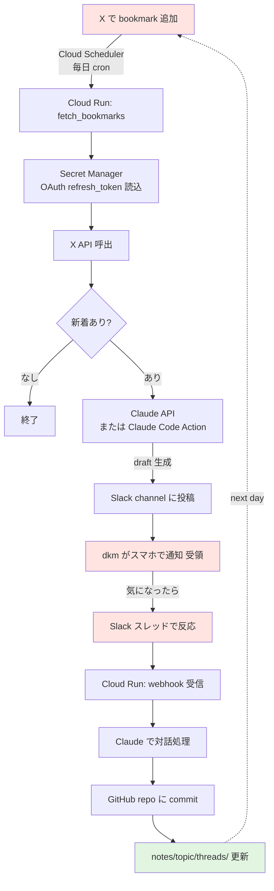
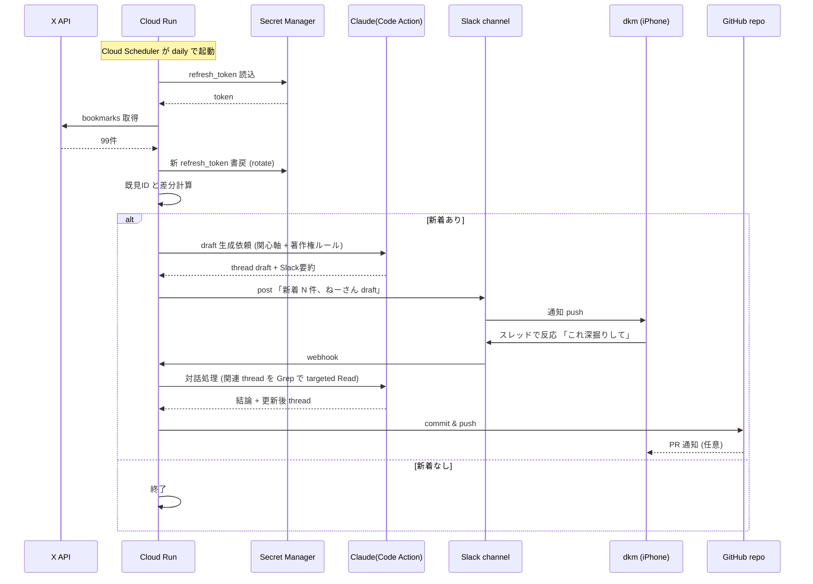
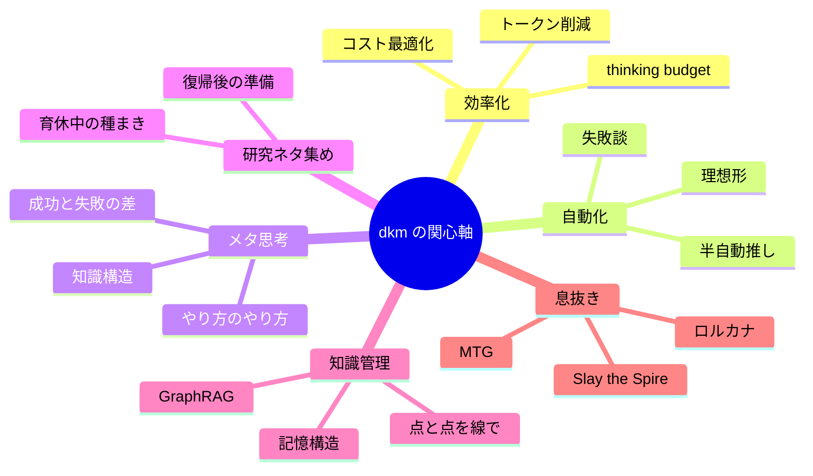
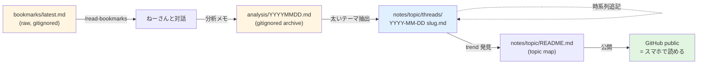
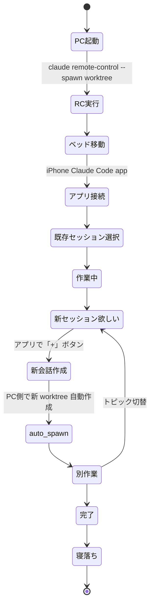
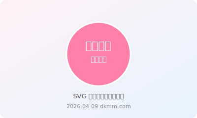

# dkmm.com アーキテクチャ図集

> Mermaid と SVG が GitHub Mobile アプリで見えるかのテスト + 実際に役立つ図の資産化。
> 全部レンダリングできれば、今後 thread に図を埋めていける = スマホレビューの解像度が上がる。

---

## 1. vision pipeline 全体アーキテクチャ (flowchart)

---

## 2. Slack 対話の sequence diagram

---

## 3. dkm の関心軸 mindmap

---

## 4. ノート運用フロー (左→右)

---

## 5. ベッドからの作業フロー (state diagram)

---

## 6. SVG 画像レンダリングテスト

下のファイルが画像として表示されたら SVG レンダリング OK:

---

## 確認ポイント (dkm 用)

スマホの GitHub Mobile アプリで上記が以下のように見えれば成功:

| 要素 | 期待される表示 |
|---|---|
| 1. flowchart | 矢印付きの図(色付きノード3つ強調) |
| 2. sequence | 横軸 actor、縦軸 時系列の sequence diagram |
| 3. mindmap | dkm を中心とした放射状マップ |
| 4. flowchart LR | 左から右への横向きフロー |
| 5. state diagram | 状態遷移図(寝落ちまでの流れ) |
| 6. SVG image | ピンクの円とテキスト |

**もし1つでも表示されへんかったら教えて**。Mermaid のバージョンとか mobile アプリの対応状況で違う可能性あるから。
