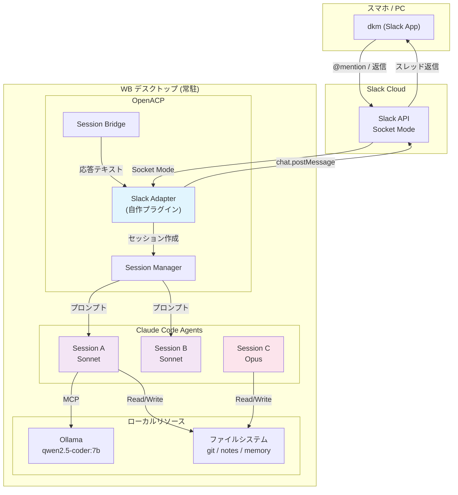
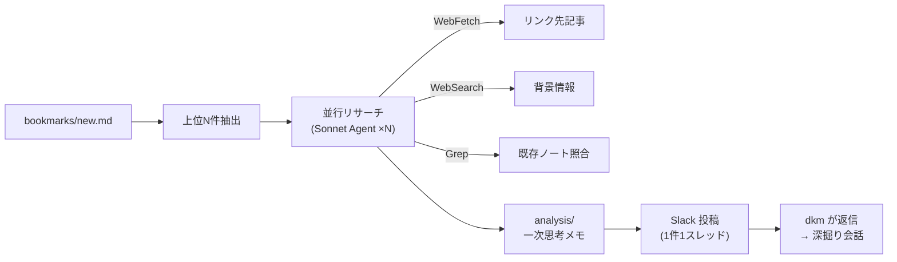
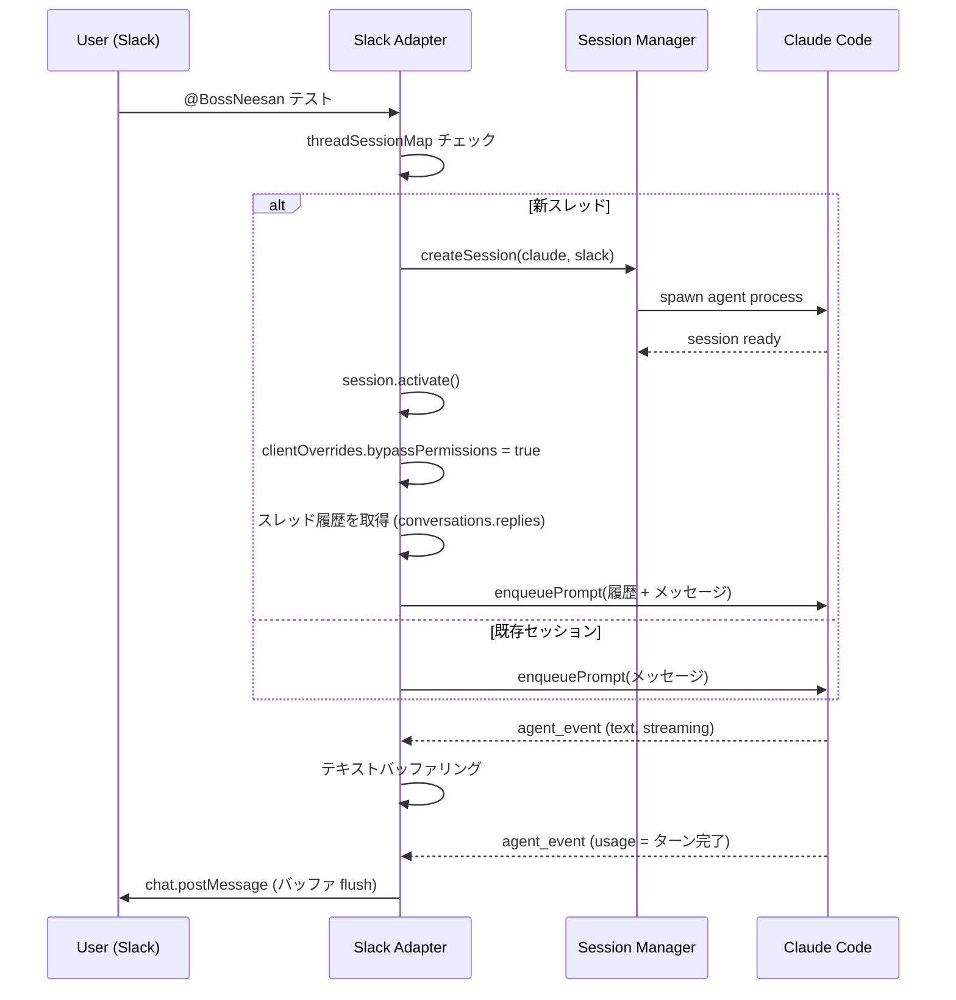

# Slack × Claude Code: ねーさんBot アーキテクチャ

> スマホの Slack から Claude Code を操作する、個人開発向けのエージェント基盤。

## なにこれ？

Slack に常駐する AI アシスタント「ねーさん」を介して、スマホから Claude Code のフルパワーを使えるシステム。メンションで会話を始めて、スレッド内で自然に対話を続けられる。画像やファイルの添付にも対応。

```
スマホ (Slack)
  ↓ @BossNeesan メンション or スレッド返信
OpenACP (WB デスクトップ)
  ↓ Socket Mode で受信
Slack Adapter (自作プラグイン)
  ↓ セッション作成 + プロンプト送信
Claude Code (ACP Agent)
  ↓ ファイル操作・コード生成・Web検索
Slack スレッドに返信
```

## アーキテクチャ図



## 主要機能

### 基本的な対話
- `@BossNeesan` でメンション → 新スレッド + 新セッション開始
- スレッド内はメンション不要で会話継続
- Bot が投稿したスレッド（ブックマーク digest 等）にも返信で反応

### ファイル添付
- 画像・PDF・CSV なんでも添付可能
- Slack API でダウンロード → Claude Code の Read tool で読み取り

### コスト管理
- デフォルトモデル: **Sonnet**（軽い質問はこれで十分）
- `/opus` でスレッド内で Opus に切替、`/sonnet` で戻す
- 1スレッド = 1セッション（コンテキスト分離）

### 会話保存
- `メモ` → 会話の要点をスレッドに箇条書き投稿
- `保存` → `notes/slack/` にファイルとして保存

### ブックマーク digest (`/bookmark-digest`)


## セッション管理



## 技術スタック

| コンポーネント | 技術 |
|---|---|
| Slack 接続 | @slack/bolt (Socket Mode) |
| エージェント基盤 | OpenACP (ACP プロトコル) |
| AI エージェント | Claude Code (ACP Agent) |
| プラグイン | TypeScript, ESM |
| テスト | vitest (19 tests) |
| ローカル LLM | Ollama (qwen2.5-coder:7b) |
| デプロイ | WB デスクトップ常駐 |

## 開発で学んだこと

### Windows 固有の問題
- `child_process.spawn` で `.cmd` ファイルは直接実行できない → `resolveAgentCommand` で JS を直接実行
- curl の UTF-8 問題 → Node.js fetch を使う

### OpenACP の内部 API
- `sessionFactory.create` ではなく `core.createSession` が正しい（wireSideEffects 付き）
- `session.activate()` を明示的に呼ぶ必要がある
- `setConfigOption` の引数は `{type: 'select', value: '...'}` 形式
- `clientOverrides.bypassPermissions = true` で権限バイパス

### テスト設計
- `vi.fn()` の mock は `this` バインディングを検証しない → 実際の Session で壊れるバグを見逃す
- mock に `this` アクセスを含めることで、メソッド抽出バグを検出可能に

## ソースコード

- Slack Adapter: `tools/openacp-adapter-slack/`
- Slack 投稿ヘルパー: `tools/slack-post.cjs`
- ブックマーク digest: `.claude/commands/bookmark-digest.md`
